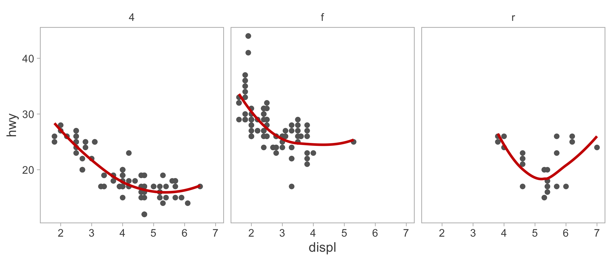

# ggsimple

This R package provides the `theme_simple` ggplot theme. The theme features thin
grey boxes around plot regions and clean facet labels.


## Installation
The `ggsimple` package is not on CRAN, but can be installed from R using:

``` r
# install.packages("devtools")
devtools::install_github(repo = "michaelmalick/ggsimple")
```


## Usage

``` r
library(ggplot2)
library(ggsimple)

g <- ggplot(mpg) +
    aes(x = displ, y = hwy) +
    geom_point(color = "grey40") +
    geom_smooth(method = "loess", color = "red3", span = 1, se = FALSE) +
    facet_wrap( ~ drv, nrow = 1) +
    theme_simple()      ## simple theme
print(g)
```


