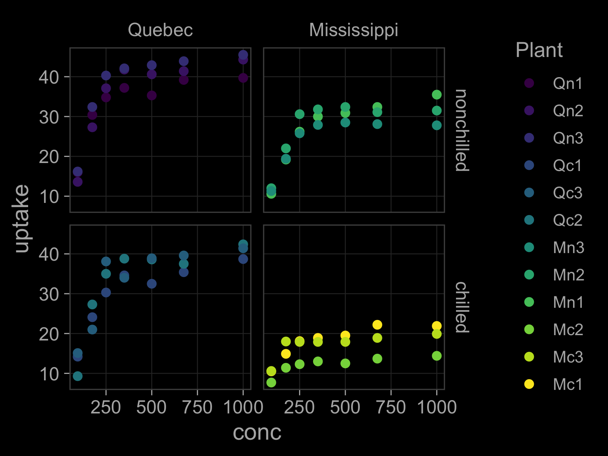

# ggsimple

This R package provides the `theme_simple` ggplot theme. Features include:
- thin grey boxes around plot regions
- clean facet labels
- light and dark modes


## Installation
The `ggsimple` package is not on CRAN, but can be installed from R using:

``` r
# install.packages("devtools")
devtools::install_github(repo = "michaelmalick/ggsimple")
```


## Usage

``` r
library(ggplot2)
library(ggsimple)

g <- ggplot(CO2) +
    aes(x = conc, y = uptake, color = Plant) +
    geom_point() +
    facet_grid(Treatment ~ Type)

## Light mode (default)
g + theme_simple()

## Dark mode
g + theme_simple(grid = TRUE, mode = "dark")
```



